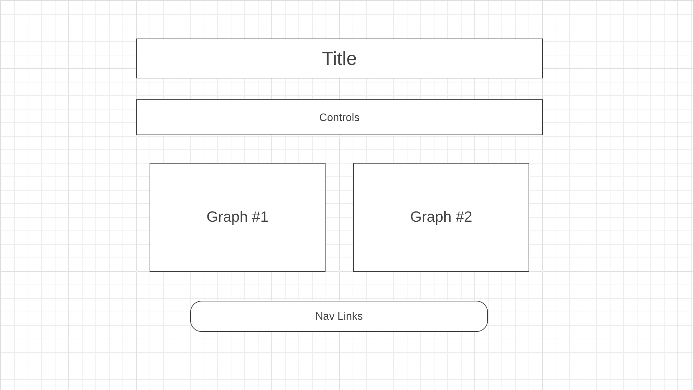

# Sorting Algorithms Visualization

Web app demonstrates how differnt sorting algorithms perform sorting.
Given an array of nums this of different length and type(ascending, descending or
random) user is able to choose an algorithm(e.g. mergeSort, bubbleSort, quickSort)
and see a visual of sorting proccess for given algorithm.
In addision this app will allow to show 2 algorithms side by side in order to show difference between two different algorithms.

# Functionality

In SAV project, users will be able to:
* Choose a type of array
* Choose a size of array
* Choose a speed of sorting
* Choose a type of sorting algorithm

In addition, this project will include:

* A production README

# Wireframes

* Controlls will include drop down menus for type and size of arrays, speed of animation an choices of algos for graphs. Also buttons to generate arrays and initialize sorting.
* Graph 1 and Graph 2 will perform sorting for given algos
* Nav links will hold links to github, linkedin, etc.

# Technologies, Libraries, APIs

This project will be implemented with the following technologies:
* The D3 API to render graphs
* Webpack and Babel to bundle and transpile the source the source JavaScript code
* npm to manage project dependencies

# Implementation Timeline

* Friday Afternoon & Weekend: Setup project using webpack. Implement first graph, using D3 library. Add basic controlls and implement one algorithm for testing. Learn more about D3.

* Monday: Implement animation for sorting and additional sorting algos. 

* Tuesday: Work on second graph and tweek controlls.

* Wednesday: Style the page with css. Add additional functionality if time permits.

* Thursday morning: Prepare project for submission

